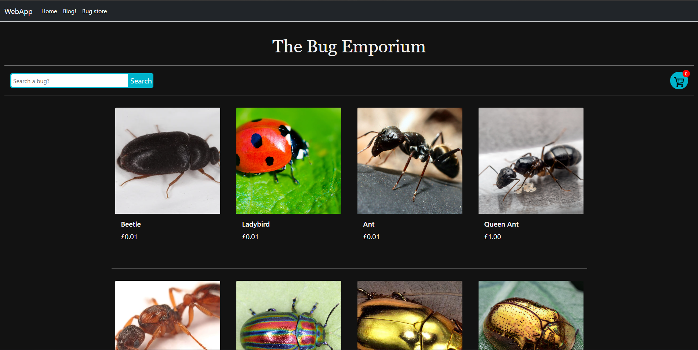
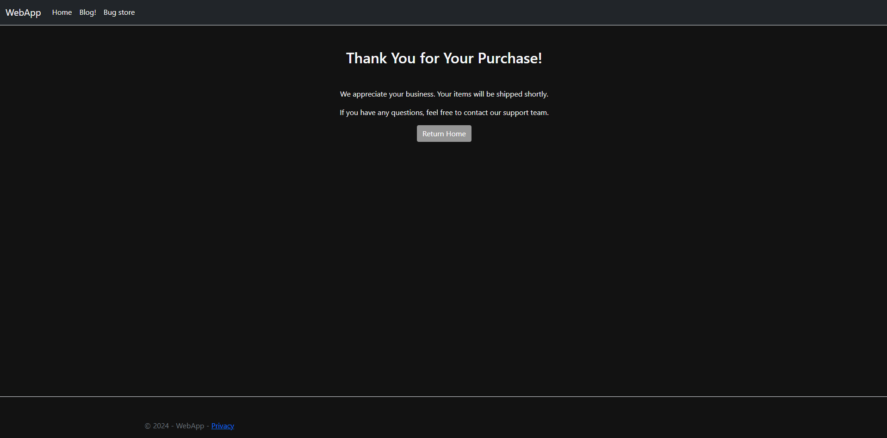

# ASP.NET-site

Hello!

This project is a local website that I will use to store future coding projects. Developed using ASP.NET Core and MVC architecture.

# Projects:

## E-commerce shop
### STATUS: COMPLETED

A mock online shop developed using ASP.NET Core. Pretends to sell bugs. Users are able to browse and order products, admins are able to create, update, and delete products.

### Features:
* SQL Server database integration for products and users.
* Products may be created, viewed, updated, and deleted.
* Dynamic shopping cart system for tracking items intended for purchase.
* Stock count for items.
* Responsive design optimized for different screen sizes.

### Setup:
As the website is not live, the e-commerce shop requires a connection to a local database to store the products.

### Pages:
* /Product/ 
Home page for the shop, users may browse the shops items here.

* /Product/viewproduct
Displays a detailed view of a product when provided with a product ID, allows users to select quantity of item and add item(s) to users cart.

* /Product/Create
Displays a form allowing for a new product to be created and added to the database

* /Product/Update
If provided with a product's ID: displays a form allowing for the product's details to be changed and updated.

* /Cart/usercart
Displays a list of all items currently present in the users cart. Users can remove items from the cart or checkout items on this screen.

* /Cart/Checkout
Simple page informing the user that their items have been successfully ordered.

## Blog page
# STATUS: ONGOING

Mock blog page text and image posts

TODO - Include a comment and reply system allowing for users to comment on posts and reply to other comments on the posts.
